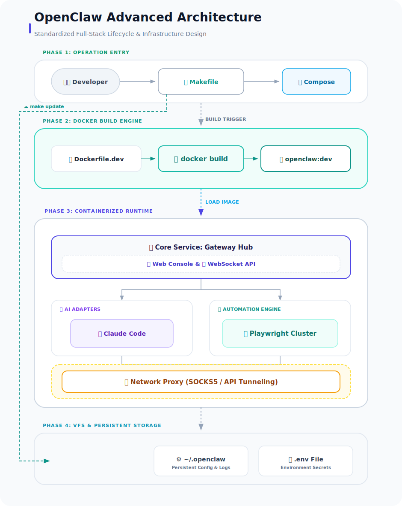

# OpenClaw DevKit 详细参考手册 (Reference Manual)

本手册提供深度技术细节，补充 `README.md` 中的精简信息。

---

## 📖 目录

- [快速开始](#快速开始详细说明)
- [版本选择](#版本选择指南)
- [运维命令](#运维命令手册)
- [环境变量](#环境变量详细说明)
- [目录结构](#目录结构详解)
- [Roles 配置](#roles-目录与软链接管理)
- [挂载配置](#挂载配置详解)
- [Slack 集成](#slack-集成)
- [架构设计](#架构与工作流)
- [安全警告](#安全警告)
- [多平台分发](#全平台支持与分发)
- [常见问题](#常见问题-faq)

---

## 快速开始详细说明

### 方式一：预构建镜像（推荐）

跳过本地构建，最快体验：

```bash
# 1. 克隆项目
git clone https://github.com/hrygo/openclaw-devkit.git
cd openclaw-devkit

# 2. 拉取镜像（可选，默认 make install 会自动选择）
docker pull ghcr.io/hrygo/openclaw-devkit:latest-office  # 办公版
# 或
docker pull ghcr.io/hrygo/openclaw-devkit:latest          # 标准版
# 或
docker pull ghcr.io/hrygo/openclaw-devkit:latest-java     # Java 增强版

# 3. 配置
cp .env.example .env
# 编辑 .env 设置 OPENCLAW_IMAGE

# 4. 启动
make up
```

### 方式二：本地构建

需要更多时间，但可完全定制。**确保已安装 Docker (V2) 和 Make**。

```bash
# 1. 初始化项目
cp .env.example .env
make update             # 同步核心源码 (首次必做)

# 2. 选择版本并构建
# 标准版 (推荐)
make install

# Office 办公/自动化版
make install office

# Java 增强版
make install java
```

> 💡 为了最佳连通性，建议在 `hosts` 中解析 `127.0.0.1 host.docker.internal` 以共享宿主机代理。

---

## 版本选择指南

### 三个版本对比

| 特性           | Standard (标准版) | Java Enhanced (增强版) |  Office (Pro 办公版)  |
| :------------- | :---------------: | :--------------------: | :-------------------: |
| 适用人群       |     全栈开发      |    Java 企业级开发     |   文案与办公自动化    |
| 核心环境       | Node, Go, Python  |     同左 + JDK 25      |    Node 22, Python    |
| AI Coding 助手 |    ✅ 完整内置     |       ✅ 完整内置       |    Pi-Coding-Agent    |
| 网页自动化     |    Playwright     |       Playwright       | Playwright + Selenium |
| 文档转换       |   Pandoc, LaTeX   |     Pandoc, LaTeX      | Pandoc, LaTeX (Full)  |
| OCR 识别       |         ❌         |           ❌            | Tesseract-OCR (中/英) |
| 图像/PDF 处理  |      Pandoc       |         Pandoc         | ImageMagick, Poppler  |
| 数据分析       |         ❌         |           ❌            |     Pandas, Numpy     |
| 工程工具       |     pnpm, Bun     |     Gradle, Maven      |       pnpm, Bun       |
| 环境特点       |   轻量、聚焦 AI   |    深度集成审计工具    |  零门槛、全集成办公   |
| 镜像大小       |       6.4GB       |         8.08GB         |         4.7GB         |

### 切换版本

```bash
# 切换到 Office 办公版
make rebuild office

# 切换到 Java 增强版
make rebuild java

# 切换回标准版
make rebuild
```

---

## 🛠️ 运维命令手册

| 命令分类       | 命令                  | 说明                                              |
| :------------- | :-------------------- | :------------------------------------------------ |
| **生命周期**   | `make up`             | 启动所有开发容器 (后台运行)                       |
|                | `make down`           | 停止并移除所有容器                                |
|                | `make install`        | **标准版**初始化 (检查环境、修复权限、构建)       |
|                | `make install office` | **Office 办公版**初始化                           |
|                | `make install java`   | **Java 增强版**初始化                             |
|                | `make restart`        | 重新启动所有服务                                  |
|                | `make status`         | 查看容器健康状态、镜像版本与访问地址              |
| **构建与更新** | `make build`          | 手动构建标准版镜像                                |
|                | `make build-java`     | 手动构建 Java 增强版镜像                          |
|                | `make build-office`   | 手动构建 Office 办公版镜像                        |
|                | `make rebuild`        | 重建标准镜像 + 重启服务                           |
|                | `make rebuild-java`   | 重建 Java 镜像 + 重启服务                         |
|                | `make rebuild-office` | 重建 Office 镜像 + 重启服务                       |
|                | `make update`         | 从 GitHub Release 自动化拉取最新源码              |
| **调试与诊断** | `make logs`           | 追踪 Gateway 主服务日志                           |
|                | `make logs-all`       | 追踪所有容器的日志                                |
|                | `make shell`          | 进入 Gateway 容器交互环境 (bash)                  |
|                | `make pairing`        | **频道配对** (如 `make pairing CMD="list slack"`) |
|                | `make test-proxy`     | **一键连通性测试** (Google/Claude API)            |
|                | `make gateway-health` | 深度检查网关 API 响应状态                         |
| **配置与备份** | `make backup-config`  | 备份所有 Agent 与全局配置 (`~/.openclaw-backups`) |
|                | `make restore-config` | 交互式恢复备份文件                                |
| **清理**       | `make clean`          | 清理孤儿容器与悬空镜像 (释放磁盘)                 |
|                | `make clean-volumes`  | **警告**: 清理所有持久化数据卷 (删除缓存数据)     |

---

## ⚙️ 环境变量详细说明 (Configuration Details)

在项目根目录的 `.env` 文件中定义：

| 变量名                  | 默认值         | 说明                                      |
| :---------------------- | :------------- | :---------------------------------------- |
| `OPENCLAW_CONFIG_DIR`   | `~/.openclaw`  | 宿主机配置映射路径                        |
| `OPENCLAW_IMAGE`        | `openclaw:dev` | 运行镜像版本                              |
| `HTTP_PROXY`            | -              | 容器内部使用的 HTTP 代理地址              |
| `HTTPS_PROXY`           | -              | 容器内部使用的 HTTPS 代理地址             |
| `SLACK_BOT_TOKEN`       | -              | Slack Bot 令牌 (xoxb格式)                 |
| `SLACK_APP_TOKEN`       | -              | Slack App 令牌 (xapp/Socket Mode)         |
| `SLACK_PRIMARY_OWNER`   | -              | 控制高权限指令的主要管理员 ID             |
| `OPENCLAW_GATEWAY_PORT` | `18789`        | Gateway Web 端访问端口                    |
| `GITHUB_TOKEN`          | -              | 提高构建/更新时访问 GitHub API 的速率限制 |

---

## 📂 目录结构详解 (Directory Structure)

| 路径                  | 详细用途                                         |
| :-------------------- | :----------------------------------------------- |
| `Makefile`            | 核心运维入口，封装了所有复杂指令                 |
| `docker-compose.yml`  | 定义容器编排、网络、数据卷挂载逻辑               |
| `Dockerfile`          | 标准版环境：集成 Go, Node, Python, Playwright 等 |
| `Dockerfile.java`     | Java 增强版：追加 JDK 25, Gradle, Maven 等       |
| `.openclaw_src/`      | 存储 OpenClaw 核心源码，由 `make update` 管理    |
| `docker-dev-setup.sh` | 初始化脚本，处理文件夹预建及权限纠正             |
| `update-source.sh`    | 增量版本同步工具                                 |
| `.env.example`        | 配置模板文件                                     |
| `docs/`               | 存放架构图等项目资产                             |
| `CLAUDE.md`           | 给 AI 助手的项目规范指引                         |
| `slack-manifest.json` | Slack App 快速导入配置单                         |

---

## 🤖 Roles 目录与软链接管理 (Roles & Symlinks)

`roles/` 目录用于存放各智能体角色的具体配置（如 `IDENTITY.md`, `TOOLS.md` 等）。为了平衡「便捷开发」与「隐私安全」，本项目建议采用**软链接 (Symbolic Link)** 模式进行管理。

### 1. 为什么使用软链接？
*   **统一管理**：直接将此目录软链接至你宿主机上的 OpenClaw 配置目录（通常是 `~/.openclaw/workspace`），只需在宿主机修改一次，DevKit 内部立即生效。
*   **隐私安全**：智能体角色配置往往包含私有的 Prompts 或业务逻辑。使用软链接可以让你在 Git 中保持该目录「干净」，避免意外将个人配置推送到公共仓库。
*   **开发者自主**：这并非强制。你可以选择建立软链接，也可以直接在 `roles/` 目录下存放物理文件。

### 2. 如何建立软链接？
在项目根目录下执行类似下方的命令（请根据你的实际路径调整）：
```bash
# 示例：将 roles 目录链接到 OpenClaw 的本地配置路径
ln -s ~/.openclaw/workspace/roles roles
```

---
 
 ## 🤖 高级多智能体配置 (Advanced Multi-Agent Patterns)

OpenClaw 支持基于 **Commander-Worker (指挥官-执行者)** 模型的高级协作模式，适用于复杂的软件研发全生命周期。

### 1. 指挥官-执行者架构
*   **指挥官 (Maintainer)**: 唯一与用户交互的入口。负责分解目标、调度 Worker、审查成果并进行 PR 合并。
*   **专用执行者 (Specialized Workers)**: 
    *   `scout`: 负责项目环境勘察与上游同步验证。
    *   `developer`: 负责功能开发与原子化提交 (Commits)。
    *   `reviewer`: 负责代码规范审查与 PR 描述校验。
    *   `tester`: 负责本地测试执行。
    *   `github-ops`: 负责 `gh` CLI 操作与 PR 创建。

### 2. 安全隔离与权限控制
建议为各 Agent 实施 **最小权限原则 (Least Privilege)**：
*   **工具隔离**: 通过 `tools.allow` 限制行为（例如：禁止 `scout` 进行 `write` 操作）。
*   **空间隔离**: 为每个 Agent 设置独立的 `workspace` 路径，避免 Git 指针冲突。
*   **运行隔离**: 为开发者角色开启 `sandbox.mode: "all"`，在 Docker 容器内进行代码实验。

### 3. 项目感知与模板遵循 (Adherence)
配置 Agent 规则以提升专业度：
*   **项目规则**: 要求 `scout` 发现并让团队遵循项目根目录的 `AGENTS.md` 或 `CLAUDE.md`。
*   **GitHub 模板**: 要求 `main` 与 `github-ops` 在创建 Issue/PR 前检索 `.github/` 下的模板。

### 4. 长期记忆系统 (Memory System)
通过在 `identity.rules` 中注入指令，让 Agent 定期更新工作区下的 `memory.md`，确保长周期任务的上下文连续性。
 
---

## 挂载配置详解

> ⚠️ **注意**：下方「宿主机路径」列中的某些路径（如 `~/.gitconfig-hotplex`）仅为示例。你需要根据**自己的实际情况**修改 `docker-compose.yml` 中的对应路径。

### 必需挂载（确保基本功能）

> ⚠️ 这些挂载使用 `.env` 中定义的变量 (`OPENCLAW_CONFIG_DIR`, `OPENCLAW_WORKSPACE_DIR`)，无需手动修改

| 宿主机路径 (.env 变量)          | 容器内路径                       | 用途说明                           |
| :------------------------------ | :------------------------------- | :--------------------------------- |
| `${OPENCLAW_CONFIG_DIR}`        | `/home/node/.openclaw-seed:ro`   | 配置文件种子（只读，首次启动需要） |
| `${OPENCLAW_WORKSPACE_DIR}`     | `/home/node/.openclaw/workspace` | 工作区文件（AI 工作目录，必需）    |
| `openclaw-state` (Named Volume) | `/home/node/.openclaw`           | 持久化状态（会话、凭证、日志等）   |

### 可选挂载（根据需求选择）

| 宿主机路径                           | 容器内路径                        | 用途说明                                              |
| :----------------------------------- | :-------------------------------- | :---------------------------------------------------- |
| `~/.claude`                          | `/home/node/.claude`              | Claude Code 会话状态（需要共享会话时挂载）            |
| `~/.gitconfig-xxx` (需调整)          | `/home/node/.gitconfig:ro`        | **独立 Git 身份**（给 AI 一个专属身份，与你主体区分） |
| `openclaw-node-modules` (Volume)     | `/app/node_modules`               | Node.js 依赖缓存（加快二次启动）                      |
| `openclaw-go-mod` (Volume)           | `/home/node/go/pkg/mod`           | Go 模块缓存（使用 Go 时挂载）                         |
| `openclaw-playwright-cache` (Volume) | `/home/node/.cache/ms-playwright` | Playwright 浏览器缓存（使用浏览器自动化时挂载）       |

### 为什么使用 `~/.gitconfig-xxx` 而非 `~/.gitconfig`？

**核心原因**：给 OpenClaw 一个**独立的 Git 身份标识**，与你的主体开发环境区分开来。

| 对比       | 你的主体环境      | OpenClaw 环境          |
| :--------- | :---------------- | :--------------------- |
| 配置文件   | `~/.gitconfig`    | `~/.gitconfig-hotplex` |
| Git 用户名 | `YourName`        | `HotPlexBot01`         |
| Git 邮箱   | `you@example.com` | `noreply@hotplex.dev`  |
| 用途       | 日常开发          | AI 自动操作            |

### 添加自定义挂载

修改 `docker-compose.yml`，在 `openclaw-gateway` 服务的 `volumes` 区域添加新的挂载条目：

```yaml
services:
  openclaw-gateway:
    volumes:
      # ... 现有挂载 ...

      # 添加自定义挂载
      - /你的/项目路径:/home/node/你的容器内路径:rw
```

### 常见扩展场景

| 场景               | 挂载示例                                        |
| :----------------- | :---------------------------------------------- |
| 访问宿主机代码仓库 | `- ~/projects:/home/node/projects:rw`           |
| 访问下载文件       | `- ~/Downloads:/home/node/Downloads:rw`         |
| 访问敏感配置       | `- ~/.aws:/home/node/.aws:ro`（只读）           |
| 共享团队配置       | `/shared/team-config:/home/node/team-config:rw` |

### ⚠️ 注意事项

1. **权限控制**：容器默认以 `node` 用户渲染 (UID 1000)。
   - **macOS/Windows**: Docker Desktop 会自动映射权限，通常无感。
   - **Linux**: 写入文件通常显示为 UID 1000。如果遇到权限问题，可参考 `docker-entrypoint.sh` 中的自动修复逻辑。
2. **路径格式**：Windows 路径需要使用 Docker 风格（如 `//c/Users/...`）或 WSL 路径
3. **只读挂载**：对不需要写入的目录使用 `:ro` 后缀，更安全
4. **重启生效**：修改挂载配置后需要 `make down && make up` 重新启动

---

## Slack 集成

快速将 OpenClaw 引入 Slack 工作流：

1. **导入配置**：在 Slack App 设置中导入 [`slack-manifest.json`](./slack-manifest.json)。
2. **配置令牌**：在 `.env` 中填写 `SLACK_BOT_TOKEN` 和 `SLACK_APP_TOKEN`。
3. **配对设备**：运行 `make pairing` 并按照终端提示操作。

---

## 架构与工作流

### 项目架构图



### 核心文件解析

- **`Makefile`**: 项目的总指挥部，封装了所有复杂运维逻辑。
- **`docker-compose.yml`**: 编排中心，负责网络隔离与数据持久化。
- **`Dockerfile*`**: 环境的基因组，定义了不同侧重的开发空间。
- **`.openclaw_src/`**: 自动化引擎的核心阵地。
- **`roles/`**: (可选) 智能体角色配置，建议通过软链接关联至 OpenClaw Workspace 以实现统一管理。
- **`.env`**: 您的个性化中心，掌控代理、端口与安全令牌。

---

## 安全警告

> ⚠️ **重要**：容器方案与宿主机直安装不可混用

本项目通过 `~/.openclaw` 目录与宿主机共享配置。如果同时使用以下两种方案，存在**安全风险**：

| 运行方式         | `gateway.bind` 要求           | 安全说明                                                          |
| :--------------- | :---------------------------- | :---------------------------------------------------------------- |
| **Docker 容器**  | `lan` (绑定 `0.0.0.0`)        | ✅ **必须** — Docker 端口映射 `127.0.0.1:18789` 限制只允许本地访问 |
| **宿主机直运行** | `loopback` (绑定 `127.0.0.1`) | ⚠️ 如果用 `lan` 会暴露到局域网                                     |

### 为什么容器必须用 `lan`？

Docker 端口映射 `127.0.0.1:18789:18789` 意味着宿主机收到的请求会转发到容器。如果容器内服务绑定 `127.0.0.1`，无法正确接收来自 Docker 网络层转发来的请求。必须绑定 `0.0.0.0` 才能正常工作。

### 推荐做法

1. **仅使用容器方案**（推荐）：保持 `gateway.bind = "lan"`，不要在宿主机安装 OpenClaw
2. **需要宿主机直运行**：将配置改为 `gateway.bind = "loopback"`，并确保容器停止后再启动宿主机服务
3. **两种都要用**：使用**独立的配置目录**（如 `~/.openclaw-docker` 和 `~/.openclaw-local`）

```bash
# 查看当前 bind 配置
cat ~/.openclaw/openclaw.json | jq '.gateway.bind'

# 修改为 loopback（宿主机直运行时）
# 在配置文件中将 "bind": "lan" 改为 "bind": "loopback"
```

---

## 全平台支持与分发 (Multi-Arch)

本项目通过 GitHub Actions 实现了全平台镜像自动构建：
- **支持架构**: `linux/amd64` (Intel/AMD), `linux/arm64` (Apple Silicon M1/M2/M3).
- **分发渠道**: [GitHub Packages (GHCR)](https://github.com/orgs/openclaw/packages).

> [!NOTE]
> **本地编译限制**: 直接在 MacBook 上运行 `make build` 产生的镜像仅限 ARM 架构。若需分发给不同平台的服务器，请参考 GitHub Actions 配置或使用 `buildx` 进行交叉编译。

---

## 常见问题 (FAQ)

<details>
<summary><b>Q: 容器内网络连不通？</b></summary>
A: 检查宿主机代理是否开启「允许局域网」。使用 <code>make test-proxy</code> 诊断。
</details>

<details>
<summary><b>Q: 启动时报错 "Cannot find module '@mariozechner/pi-ai/oauth"？</b></summary>
A: 这是因为预构建镜像中的依赖版本与源码不匹配。执行以下命令清理后重试：

<pre><code>make down && docker volume rm openclaw-node-modules && make up</code></pre>

<b>原因</b>：named volume 会持久化 <code>node_modules</code>，当源码更新后，依赖版本可能发生变化，但 volume 仍保留旧版本，导致模块找不到。
</details>

<details>
<summary><b>Q: 如何手动更新 OpenClaw？</b></summary>
A: 运行 <code>make update</code>。它会调用 GitHub API 自动对比并同步最新代码。
</details>

<details>
<summary><b>Q: 配置文件在哪里？</b></summary>
A: 容器内位于 <code>~/.openclaw/</code>，宿主机通过 <code>openclaw-state</code> 卷持久化。
</details>

<details>
<summary><b>Q: 如何导出/备份配置？</b></summary>
A: 运行 <code>make backup-config</code> 备份到宿主机 <code>~/.openclaw-backups/</code> 目录。
</details>

---

<p align="center">
  <a href="../README.md">← 返回主 README</a>
</p>
